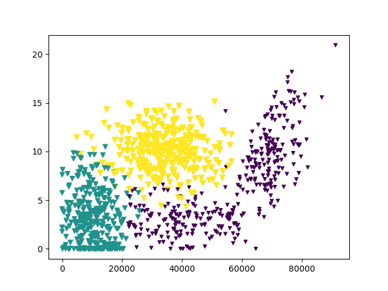
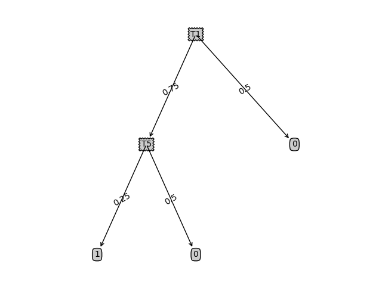

# ml
机器学习
## k临近算法
kNN.py 提供了两个方法，一个是读取文件中的训练数据，另一个是对输入数据进行分类 
testkNN.py从datingTestSet2.txt中读取训练数据，获取[68607,9.661909,0.350772]的分类，然后根据训练数据的第一列为X轴，第二列为Y轴生成训练数据的分布图 

## 决策树
ID3.py ID3算法实现的决策树 
treePlotter.py 基于matplotlib的决策树展示 
运行testID3.py从dataset.txt中读取训练数据，生成决策树，并保存到tree.txt中 
运行testID31.py查看labels=['T1','T5']，testVec=['0.75','0.25']分类结果 
